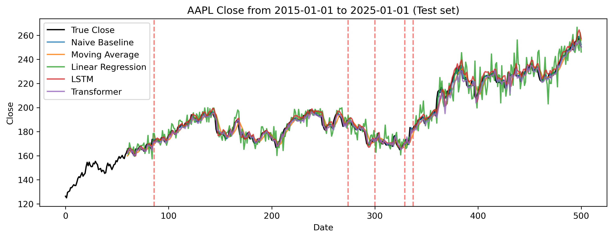
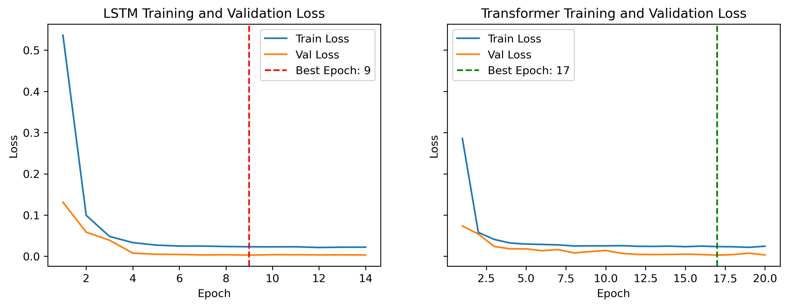
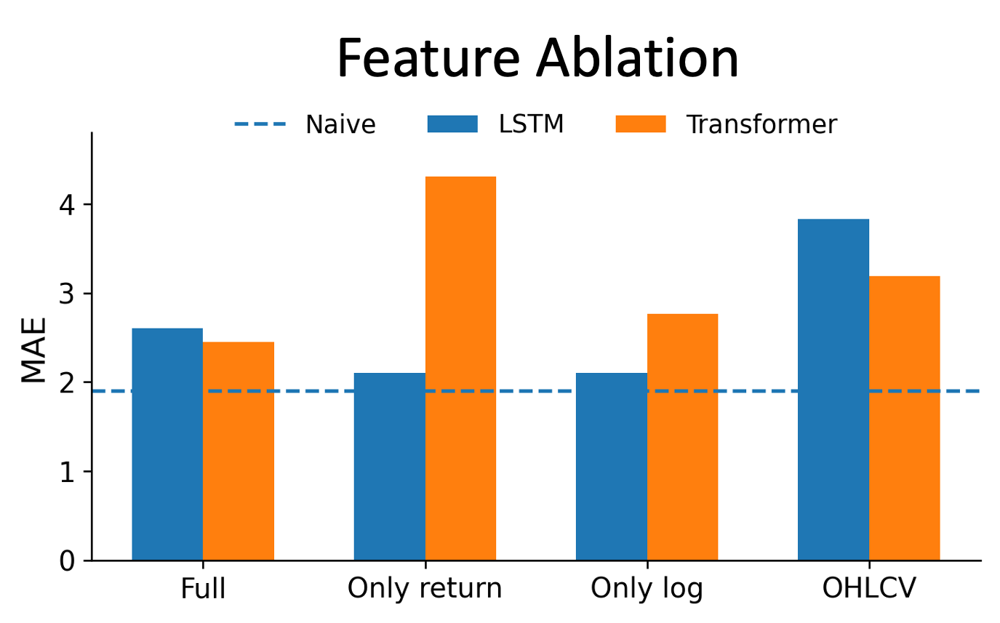
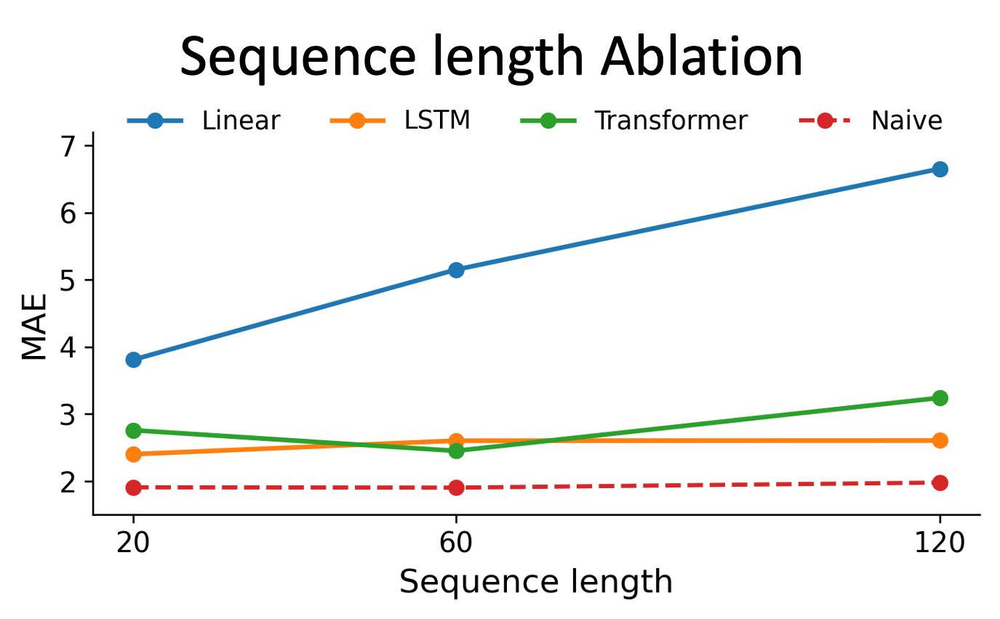

## Financial time-series prediction with baselines, LSTM, and Transformer

### Overview
This project implements a time-series forecasting framework for stock price prediction using LSTM and Transformer, and benchmarks against traditional statistical baselines (Naive baseline, Moving average baseline, and Linear regression baseline). 

The current implementation serves as a foundational time-series ML engineering practices covering data preprocessing, dataset construction, model training, and evaluation. Error analysis and abalation experiments are studied as well to understand about the model.

<!-- This project is currently a forecasting benchmark, not a production trading system. Forecasting accuracy does not directly imply trading profitability.  -->

(A related demo of time series prediction: https://github.com/zhanmiaoh/demo_timeseries_prediction)
<!-- 
Future work to be done: rigorous ablation study, predict on return or direction. 
-->

<!-- The task is to use the past 60 trading days to predict the next day's closing price for AAPL. -->

<!-- This repository is intended as a learning / reproduction / adaptation project for time-series forecasting, with an emphasis on:
- chronological data split
- avoiding data leakage
- comparing against strong baselines
- reporting metrics in the original price space -->

---

<!-- ### Dataset
- Ticker: AAPL
- Date range: 2015-01-01 to 2025-01-01

#### Input features
- Open
- High
- Low
- Close
- Volume
- return
- log_return -->


### Task description
Given daily information up to day t (e.g., previous 60 trading days), predict the target at day t+1.

### Data and Features
- Ticker: AAPL
- Period: 2015-01-01 to 2025-01-01
- Features: Open, High, Low, Close, Volume, return, log_return
- Current target: Close *(will be changed to `return` or `direction`)*

### Exploratory Data Analysis 
An exploratory data analysis notebook is included to inspect the data distribution and time-series characteristics, including:
- Time series plots for Close/Volume/Return
- Distribution of Return and Log Return
- Rolling Mean and Rolling Standard Deviation
- Statistical properties of train/validation/test splits

---

### Pipeline
1. Load raw stock data for the selected ticker and date range 
2. Engineer causal features (return, log_return)
3. Split data chronologically into train / validation / test sets
4. Fit scaler on training set only, then transform all splits
5. Build sliding-window datasets with `seq_length = 60` 
6. Train and evaluate baselines and deep learning models 
The best model checkpoints are saved based on the lowest validation loss during training and restored for evaluation. 
7. Report MAE / RMSE / MAPE on the original price scale


---

### Metrics and Visualization
Training is performed in the scaled space using MSE loss.
Final evaluation is reported in the original price space.

| Model | MAE | RMSE | MAPE |
| :--- | :--- | :--- | :--- |
| Naive Baseline | 1.9045 | 2.6003 | 0.9735% |
| Moving Average | 3.1543 | 4.0174 | 1.6129% |
| Linear Regression | 5.1491 | 6.8564 | 2.5840% |
| LSTM | 2.2235 | 3.0668 | 1.1325% |
| Transformer | 2.6653 | 3.6721 | 1.3425% |

**Note**: The strong performance of naive baseline is due to the high short-term continuity and strong autocorrelation in absolute stock prices ($Y_t\approx Y_{t-1}$). Replacing the prediction target to returns will reduce this persistence effect and provide a more informative setting. 


Prediction curve, where the dashed lines correspond to top-5 error timepoints of LSTM predictions:


Training and validation loss:



---

### Error analysis & Ablation study
Error analysis of (1) residual histogram and (2) top-K error interval have been down. The high prediction errors are related to the high-volatility. 
<!-- 1. Residual histogram
2. top-K error interval
3. High/low volatility  -->
<table>
  <tr>
    <td></td>
    <td></td>
  </tr>
</table>

- Return-style features are more informative than raw OHLCV alone.
LSTM performs best with cleaner inputs (one of return or log return);
- Transformer is more sensitive to input feature choice. 
- Longer context is not always better: LSTM prefers 20 days, Transformer around 60.
- Even the best learned model does not beat the naïve last-close baseline. 


---

### Roadmap & Future work
- For the target of `Return`/`Log Return`/`Direction`, input featrures and practical strategies need to be supplemented, otherwise it is hard for the deep model to learn effective information.
- Implement binary classification of price directions as a startpoint and a simpler alternative to continuous forecasting.
<!-- - **Ablation** studies on feature sets and lookback windows. 
    - Features OHLCV only vs OHLCV + return/log_return
    - Evaluate the impact of lookback window (`seq_length=20/60/120`)
    - Evaluate the impact of hidden layer dimension in LSTM (`hidden_size=32/64/128`), in Transformer (`d_model=32/64`, `dim_feedforward=128/256/2048`);  -->
<!-- - Error analysis: Perform residual-based error analysis across different volatility regimes. -->

- Implement backtesting to assess whether predictive signals translate into trading performance.
- Add walk-forward evaluation instead of a single fixed chronological split.


---

### Repo structure
```
├── config.json
├── data
│   ├── data_loader.py
│   ├── dataset.py
│   ├── preprocess.py
│   ├── processed
│   └── raw
├── models
│   ├── baselines.py
│   ├── lstm.py
│   └── transformer.py
├── training
│   └── train.py
├── evaluation
│   ├── load_results.py
│   ├── metrics.py
│   ├── plotting.py
│   └── save_results.py
├── main.py
├── outputs
│   ├── 20260314_231109
│   └── log.txt
├── notebooks
│   ├── 1-data_eda.ipynb
│   └── 2-data_process.ipynb
└── README.md
```

How to run
```bash
python main.py
```

Output results are saved under:

```bash
outputs/<timestamp>/
```


<!-- ### Ackownledgement 
This project is based on reproduction of ..., with modifications in experiment organization, logging and evaluation. -->


